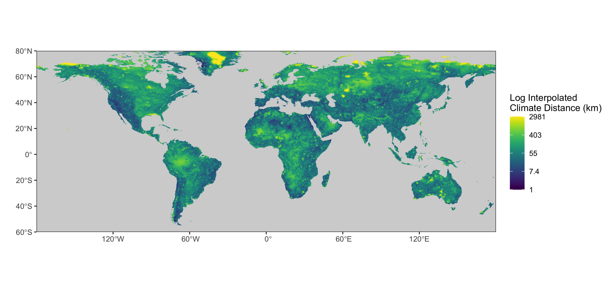

# Climate-Distance
## Global climate distance code

### Input Climate Data
Raw input climate files can be downloaded from CHELSA using the following links:\
[2011-2040 Temp](https://os.zhdk.cloud.switch.ch/chelsav2/GLOBAL/climatologies/2011-2040/GFDL-ESM4/ssp370/bio/CHELSA_bio1_2011-2040_gfdl-esm4_ssp370_V.2.1.tif)\
[2040-2070 Temp](https://os.zhdk.cloud.switch.ch/chelsav2/GLOBAL/climatologies/2041-2070/GFDL-ESM4/ssp370/bio/CHELSA_bio1_2041-2070_gfdl-esm4_ssp370_V.2.1.tif)\
[2011-2040 Rainfall](https://os.zhdk.cloud.switch.ch/chelsav2/GLOBAL/climatologies/2011-2040/GFDL-ESM4/ssp370/bio/CHELSA_bio12_2011-2040_gfdl-esm4_ssp370_V.2.1.tif)\
[2040-2070 Rainfall](https://os.zhdk.cloud.switch.ch/chelsav2/GLOBAL/climatologies/2041-2070/GFDL-ESM4/ssp370/bio/CHELSA_bio12_2041-2070_gfdl-esm4_ssp370_V.2.1.tif)\
Details of the CHELSA climatologies can be found [here.](https://chelsa-climate.org/wp-admin/download-page/CHELSA_tech_specification_V2.pdf)

**CHELSA Reference:** Karger, D.N., Conrad, O., Böhner, J., Kawohl, T., Kreft, H., Soria-Auza, R.W., Zimmermann, N.E., Linder, P., Kessler, M. (2017): Climatologies at high resolution for the Earth land surface areas. Scientific Data. 4 170122. [https://doi.org/10.1038/sdata.2017.122](https://doi.org/10.1038/sdata.2017.122)

## 1). Pre-processing and sampling of Climate Data
[Sample and process CHELSA data script](Climate_input_sampling.R)\
Crops CHELSA climate data to land area and outputs each layer as a "full".tif, then randomly samples chosen % of cells from each input layer and export as "processed".tif. Requires decent RAM and high vector limit to run. 

## 2). Climate data rounding and conversion
[Rounding and conversion script](Rounded_climate_inputs.R)\
Rounds temperature and rainfall data to desired number of sig fig/decimals, then stacks the climate layers into a raster. Finally converts stacked raster into a large .csv file. Conversion from .tif raster to .csv requires large RAM and high vector limit so may need to be run separately using this [tiff to csv python script](Tiff_to_CSV.ipynb). 

## * Choosing an appropriate climate threshold 
This python notebook examines the effect of slope and climate threshold on distance to future analogue usinf 2D simulations, [simulation python notebook](Simulations_climate_distance_github_version.ipynb). 
This document summarises the simulations and mathematically characterised of the effect of slope and threshold on climate distance [simulation notes](Maths_notes_on_climate_distance.pdf).

## 3). Calculation of climate distances (to be run on cluster)
[Climate distance cluster script](Array_cluster_code.R)\
Takes the randomly sampled % of cells .csv and calculates climate distance for temperature and rainfall between time point 1 and time point 2. Set up to run in parallel over many cores to process the entire .csv input file. 
More efficient script which finds the closest 20 climate distances: [Updated cluster script](June25_Cluster_Code_v4.R).

## 4). Convert Climate Distance to KM
[Convert climate distance into KM](CD_in_m_to_KM.R).

## 5). Interpolate Climate Distances and Plot
[Plot interpolated climate distances](Interpolated_World_Map.R).

## 6). Input data for Analyses
Cropland extent and change from Potapov, P., Turubanova, S., Hansen, M.C. et al. Global maps of cropland extent and change show accelerated cropland expansion in the twenty-first century. Nat Food 3, 19–28 (2022). https://doi.org/10.1038/s43016-021-00429-z

Slope was derived from a digital elevation map using a [Google Earth Engine script](https://code.earthengine.google.com/49c9a979f4383f7338bdbd856d51f5a7). Digital elevation map: Earth Resources Observation Science (EROS) Center, 2018. Global 30 Arc-Second Elevation (GTOPO30) [https://doi.org/10.5066/F7DF6PQS](https://doi.org/10.5066/F7DF6PQS)

Global Field Sizes from Lesiv, M. et al. Estimating the global distribution of field size using crowdsourcing. Global Change Biology 25, 174–186 (2019).[https://doi.org/10.1111/gcb.14492](https://doi.org/10.1111/gcb.14492)

Centers of Agrobiodiversity adapted from Maxted, N., Vincent, H. Review of congruence between global crop wild relative hotspots and centres of crop origin/diversity. Genet Resour Crop Evol 68, 1283–1297 (2021). [https://doi.org/10.1007/s10722-021-01114-7](https://doi.org/10.1007/s10722-021-01114-7)
 
## 7). Analysis Scripts
[Cropland vs non-cropland](Cropland.R) \
[Change in Crop Area](Crop_Expan_Loss.R) \
[Steep vs not steep Cropland](Crop_Slope.R) \
[Field Size](Field_Size.R) \
[Centers of Agrobiodiversity](Centres_Agrobiodiversity.R) \
These scripts output tifs which can be converted to CSV using [tiff to CSV python script](Tiff_to_CSV.ipynb) for stats and visualisation. 

